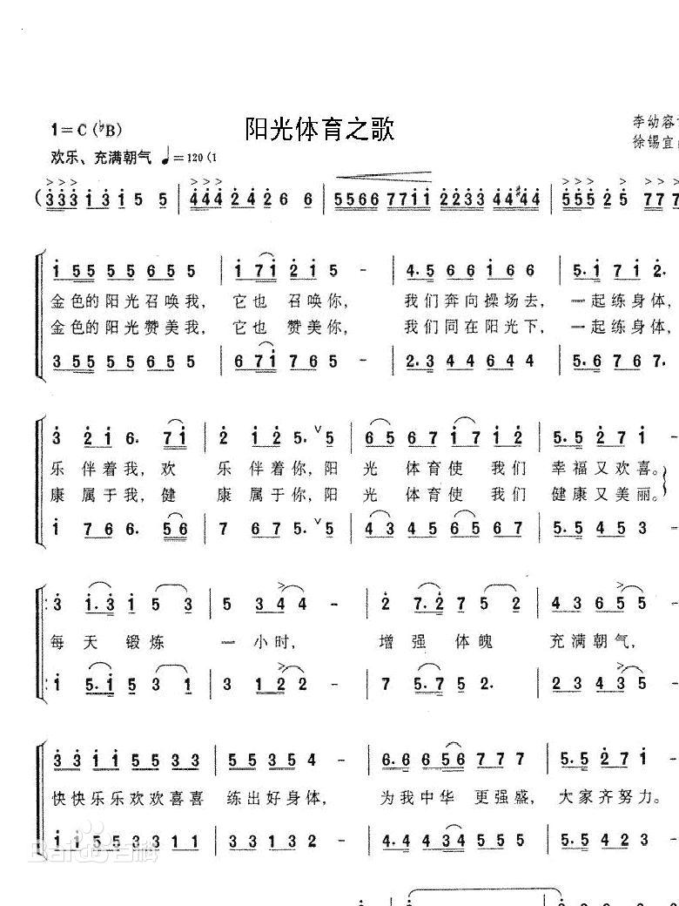

# 广播体操

## 在线预览

**需要一定的时间进行加载，有时可能非常耗时，如果加载出错请刷新页面。**

<b>七彩阳光</b>

阳光体育之歌（《七彩阳光》原唱版）：

<audio src="群星 - 阳光体育之歌（《七彩阳光》原唱版）.mp3" preload="auto" controls></audio>

<b>放飞理想</b>

放飞理想（无开头）（节奏版结尾）：

<audio src="放飞理想（无开头）（节奏版结尾）.mp3" preload="auto" controls></audio>

放飞理想：

<audio src="群星 - 放飞理想.mp3" preload="auto" controls></audio>

<b>时代在召唤</b>

时代在召唤：

<audio src="群星 - 时代在召唤.mp3" preload="auto" controls></audio>

<b>大课间跑步</b>

大课间跑步音乐：

<audio src="群星 - 大课间跑步音乐.mp3" preload="auto" controls></audio>

<b>眼保健操</b>

眼保健操口令：

<audio src="眼保健操口令.mp3" preload="auto" controls></audio>

## 下载

[广播体操.zip](广播体操.zip)
